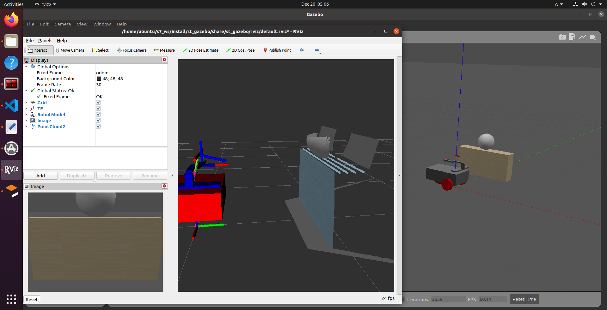

# st_robot
test sim robot for move & elevator & arm

# how to use
## create colcon workspace

```shell
mkdir -p ~/ros2_ws/src
```

## git clone

```shell
cd -p ~/ros2_ws/src
git clone git@github.com:eriac/st_robot.git
```

## build

```shell
cd -p ~/ros2_ws/
source /opt/ros/foxy/setup.bash 
colcon build
```

## joy
connet [logicool F310](https://gaming.logicool.co.jp/ja-jp/products/gamepads/f310-gamepad.html) via USB

or edit [joy_distributer.cpp](st_nodes/src/joy_distributer.cpp)

## launch

```shell
source /opt/ros/foxy/setup.bash 
source ~/ros2_ws/install/setup.bash
ros2 launch st_gazebo main.launch.py 
```




